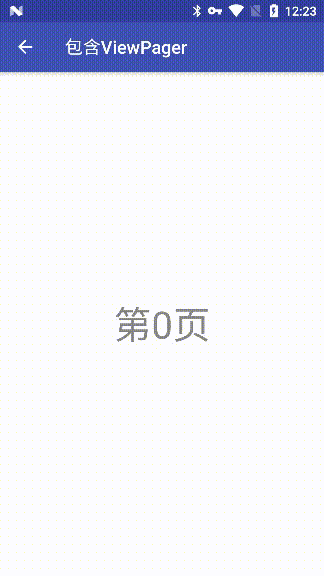
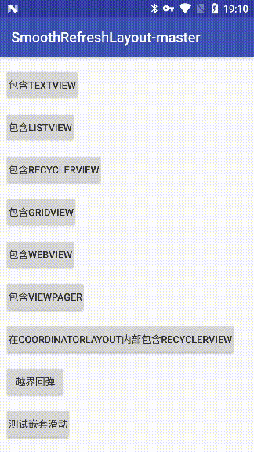
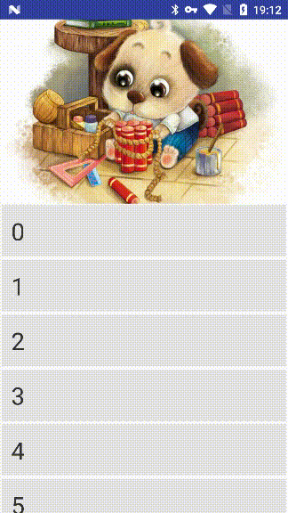

# SmoothRefreshLayout
## English | [中文](https://github.com/dkzwm/SmoothRefreshLayout/blob/master/README_CN.md)

A highly efficient refresh library for Android.In theory,Can support all Views.It's easy to use and more powerful than SwipeRefreshLayout.    
Part of the open source library comes from [android-Ultra-Pull-To-Refresh](https://github.com/liaohuqiu/android-Ultra-Pull-To-Refresh).    
Thank him for providing such a great open source library ！

## Demo
Download [Demo.apk](https://raw.githubusercontent.com/dkzwm/SmoothRefreshLayout/master/apk/demo.apk)    

## Features
 1.Support 5 modes: refresh,loadMore,overScroll,both(refresh & loadMore),none;    
 2.Support nestedScroll;    
 3.Support all views;    
 4.Support Two-Level refresh;    
 5.Support DrawerStyle;    
 
## Snapshot
* Test drawerStyle , newly added!
   <div class='row'>
       
   </div>
* Test two-level refresh , newly added !     
   <div class='row'>
       
   </div>
* With frameLayout    
   <div class='row'>
       
   </div>
* With textView     
	<div class='row'>
    	
	</div>
* With listView    
	<div class='row'>
    	
	</div>
* With gridView    
	<div class='row'>
		
	</div>
* With recyclerView    
	<div class='row'> 
   		
	</div>
* With viewPager    
	<div class='row'> 
	   	
	</div>
* With webView    
	<div class='row'> 
    	
	</div>
* With recyclerView in coordinatorLayout
	<div class='row'> 
    	
	</div>
* OverScroll  
	<div class='row'> 
    	
	</div>

## How to use    
#### Gradle
````
repositories {  
    ...
    maven { url 'https://jitpack.io' }  
}

dependencies {  
    compile 'com.github.dkzwm:SmoothRefreshLayout:1.0.1'
}
````
#### Config
The attr:    
Use `app:sr_content` to specifies the resource ID of the content view.    

Use `app:sr_resistance` to set the resistence while you are moving(pull up or pull down),default is `1.65f`.   
 
Use `app:sr_resistance_of_pull_up` to set the resistence while you are moving footer,default is `1.65f`.    

Use `app:sr_resistance_of_pull_down` to set the resistence while you are moving header,default is `1.65f`.    

Use `app:sr_ratio_of_refresh_height_to_refresh` to set the ratio of the height to trigger refresh, default is: `1.1f`.   
 
Use `app:sr_ratio_of_header_height_to_refresh` to set the ratio of the height of the header to trigger refresh, default is: `1.1f`.    

Use `app:sr_ratio_of_footer_height_to_refresh` to set the ratio of the height of the footer to trigger refresh, default is: `1.1f`.    

Use `app:sr_can_move_the_max_ratio_of_refresh_height` to set the max ratio of height of the refresh view when the finger moves, default is: `0f`,indicates that the condition will never be triggered.    

Use `app:sr_can_move_the_max_ratio_of_header_height` to set the max ratio of height of the header when the finger moves, default is: `0f`,indicates that the condition will never be triggered.    

Use `app:sr_can_move_the_max_ratio_of_footer_height` to set the max ratio of height of the footer when the finger moves, default is: `0f`,indicates that the condition will never be triggered.    

Use `app:sr_duration_to_close_of_refresh` to set the duration of refresh view to return back to the start position, default is `500`.    

Use `app:sr_duration_to_close_of_header` to set the duration of header to return back to the start position, default is `500`.    

Use `app:sr_duration_to_close_of_footer` to set the duration of footer to return back to the start position, default is `500`.    

Use `app:sr_duration_of_back_to_refresh_height` to set the duration of the refresh view to return back to the trigger the refresh position, default is `200`.    

Use `app:sr_duration_of_back_to_header_height` to set the duration of the header to return back to the trigger the refresh position, default is `200`.    
 
Use `app:sr_duration_of_back_to_footer_height` to set the duration of the footer to return back to the trigger the refresh position,
 default is `200`.    
 
Use `app:sr_enable_pin_content` to set enable pinned the content, default is `false`.    

Use `app:sr_enable_pull_to_refresh` to set enable pull to refresh, default is `false`.    

Use `app:sr_enable_keep_refresh_view` to set enable keep the refresh view, default is `true`.   

Use `app:sr_enable_over_scroll` to set enable over scroll feature, default is `true`.   

Use `app:sr_layout_gravity` to set the gravity of the other views in the viewgroup.    

Use `app:sr_mode` to set the mode, default is `none`.   

* Config in xml
````
<me.dkzwm.smoothrefreshlayout.SmoothRefreshLayout
    android:id="@+id/smoothRefreshLayout_with_textView_activity"
    xmlns:android="http://schemas.android.com/apk/res/android"
    xmlns:app="http://schemas.android.com/apk/res-auto"
    android:layout_width="match_parent"
    android:layout_height="match_parent"
    app:sr_can_move_the_max_ratio_of_footer_height="2"
    app:sr_can_move_the_max_ratio_of_header_height="2"
    app:sr_can_move_the_max_ratio_of_refresh_height="2"
    app:sr_content="@+id/textView_with_textView_activity_desc"
    app:sr_duration_of_back_to_footer_height="300"
    app:sr_duration_of_back_to_header_height="300"
    app:sr_duration_of_back_to_refresh_height="300"
    app:sr_duration_to_close_of_footer="1000"
    app:sr_duration_to_close_of_header="1000"
    app:sr_duration_to_close_of_refresh="1000"
    app:sr_enable_keep_refresh_view="true"
    app:sr_enable_over_scroll="true"
    app:sr_enable_pin_content="false"
    app:sr_enable_pull_to_refresh="false"
    app:sr_mode="both"
    app:sr_ratio_of_footer_height_to_refresh="1.5"
    app:sr_ratio_of_header_height_to_refresh="1.5"
    app:sr_ratio_of_refresh_height_to_refresh="1.5"
    app:sr_resistance="1.7"
    app:sr_resistance_of_pull_down="1.7"
    app:sr_resistance_of_pull_up="1.7">

    <TextView
        android:id="@+id/textView_with_textView_activity_desc"
        android:layout_width="match_parent"
        android:layout_height="match_parent"/>

    <ImageView
        android:layout_width="wrap_content"
        android:layout_height="wrap_content"
        android:src="@mipmap/ic_launcher_round"
        app:sr_layout_gravity="center"/>
</me.dkzwm.smoothrefreshlayout.SmoothRefreshLayout>
````
* Config in code
````
mRefreshLayout.setMode(SmoothRefreshLayout.MODE_BOTH);
mRefreshLayout.setEnableOverScroll(true);
mRefreshLayout.setEnablePinContentView(false);
mRefreshLayout.setEnablePullToRefresh(false);
mRefreshLayout.setEnableKeepRefreshView(true);
mRefreshLayout.setDurationToClose(1000);
mRefreshLayout.setDurationToBackHeader(300);
mRefreshLayout.setDurationToBackFooter(300);
mRefreshLayout.setDurationToCloseHeader(1000);
mRefreshLayout.setDurationToBackFooter(1000);
mRefreshLayout.setCanMoveTheMaxRatioOfRefreshHeight(2);
mRefreshLayout.setCanMoveTheMaxRatioOfHeaderHeight(2);
mRefreshLayout.setCanMoveTheMaxRatioOfFooterHeight(2);
mRefreshLayout.setRatioOfRefreshViewHeightToRefresh(1.5f);
mRefreshLayout.setRatioOfHeaderHeightToRefresh(1.5f);
mRefreshLayout.setRatioOfFooterHeightToRefresh(1.5f);
mRefreshLayout.setResistance(1.7f);
mRefreshLayout.setResistanceOfPullUp(1.7f);
mRefreshLayout.setResistanceOfPullDown(1.7f);
````
* Other config:    
`setEnablePinRefreshViewWhileLoading(boolean enable)` this method can only be enabled if setEnablePinContentView and setEnableKeepRefreshView are set be true, material style need set this.    
`setFooterView(IRefreshView footer)` set the footer.    
`setHeaderView(IRefreshView header)` set the header.   
`setContentView(View content)` set the content.
`setLoadMoreScrollTargetView(View view)` set loadMore scroll target view, for example the content view is a FrameLayout, with a 
listView in it. You can call this method, set the listView as load more scroll target view. Load more compat will try to make it 
smooth scrolling.     
* Set refresh listener
````
mRefreshLayout.setOnRefreshListener(new RefreshingListenerAdapter() {
       @Override
       public void onRefreshBegin(final boolean isRefresh) {
            //to do something.
       }
});
Or
mRefreshLayout.setOnRefreshListener(new SmoothRefreshLayout.OnRefreshListener() {
        @Override
        public void onRefreshBegin(final boolean isRefresh) {
            //to do something.
        }
        @Override
        public void onRefreshComplete() {
            //to do something.
        }
});
````
* Callbacks
````
public interface OnChildScrollUpCallback {
        boolean canChildScrollUp(SmoothRefreshLayout parent, @Nullable View child,
                                 @Nullable IRefreshView header);
}
public interface OnChildScrollDownCallback {
        boolean canChildScrollDown(SmoothRefreshLayout parent, @Nullable View child,
                                   @Nullable IRefreshView footer);
}
public interface OnLoadMoreScrollCallback {
        boolean onScroll(View content, float deltaY);
}
````
## Thanks
- [liaohuqiu android-Ultra-Pull-To-Refresh](https://github.com/liaohuqiu/android-Ultra-Pull-To-Refresh)    
- [pnikosis material-progress](https://github.com/pnikosis/materialish-progress)      

## License

	MIT License

	Copyright (c) 2017 dkzwm

	Permission is hereby granted, free of charge, to any person obtaining a copy
	of this software and associated documentation files (the "Software"), to deal
	in the Software without restriction, including without limitation the rights
	to use, copy, modify, merge, publish, distribute, sublicense, and/or sell
	copies of the Software, and to permit persons to whom the Software is
	furnished to do so, subject to the following conditions:

	The above copyright notice and this permission notice shall be included in all
	copies or substantial portions of the Software.

	THE SOFTWARE IS PROVIDED "AS IS", WITHOUT WARRANTY OF ANY KIND, EXPRESS OR
	IMPLIED, INCLUDING BUT NOT LIMITED TO THE WARRANTIES OF MERCHANTABILITY,
	FITNESS FOR A PARTICULAR PURPOSE AND NONINFRINGEMENT. IN NO EVENT SHALL THE
	AUTHORS OR COPYRIGHT HOLDERS BE LIABLE FOR ANY CLAIM, DAMAGES OR OTHER
	LIABILITY, WHETHER IN AN ACTION OF CONTRACT, TORT OR OTHERWISE, ARISING FROM,
	OUT OF OR IN CONNECTION WITH THE SOFTWARE OR THE USE OR OTHER DEALINGS IN THE
	SOFTWARE.