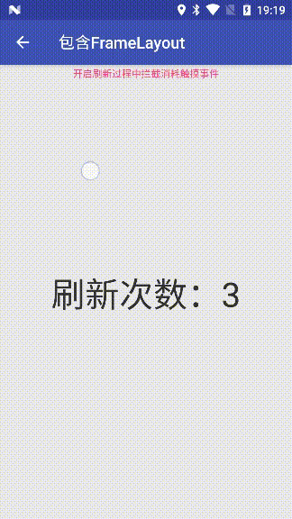
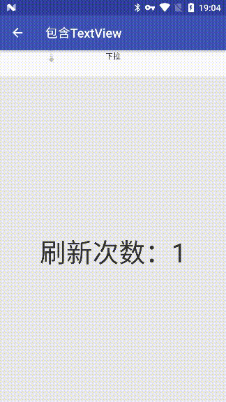
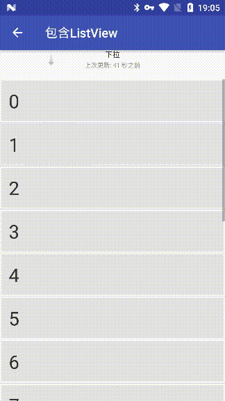
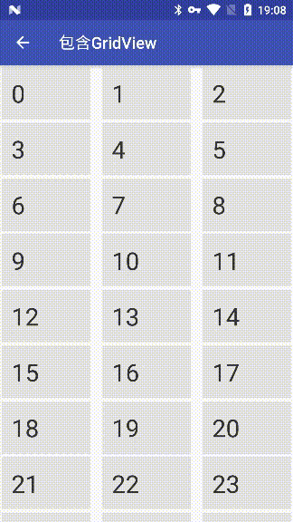
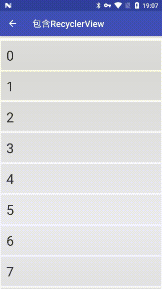
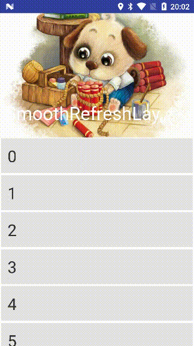
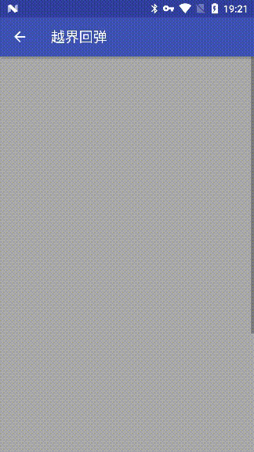

# SmoothRefreshLayout
## [English](https://github.com/dkzwm/SmoothRefreshLayout/blob/master/README.md) | 中文
一个高效的Android刷新库，理论上支持所有的视图，比官方的SwipeRefreshLayout更强大且使用方便.    
本开源库的部分代码来自[android-Ultra-Pull-To-Refresh](https://github.com/liaohuqiu/android-Ultra-Pull-To-Refresh).    
非常感谢他提供的这么棒的开源项目！    

## 演示程序
下载 [Demo.apk](https://raw.githubusercontent.com/dkzwm/SmoothRefreshLayout/master/apk/demo.apk)    
 
## 特性
 1.支持5种模式: refresh(刷新),loadMore(加载更多),overScroll(越界回弹),both(刷新和加载更多),none;    
 2.支持嵌套滑动;    
 3.支持所有的视图;   
 4.支持2级刷新(暂时只支持头部视图的二级刷新);   
 5.支持抽屉样式; 
 
## 快照
* 测试QQ浏览器样式,新添加的效果！
	<div class='row'>
		
	</div>
* 测试QQ活动样式,新添加的效果！
	<div class='row'>
	   
	</div>
* 测试2级刷新,新添加的效果!     
	<div class='row'>
		
	</div>
* 包含FrameLayout    
	<div class='row'>
	   
	</div>
* 包含TextView     
	<div class='row'>
    	
	</div>
* 包含ListView    
	<div class='row'>
    	
	</div>
* 包含GridView    
	<div class='row'>
		
	</div>
* 包含RecyclerView    
	<div class='row'>
		
	</div>
* 包含ViewPager    
	<div class='row'> 
	   	
	</div>
* 包含WebView    
	<div class='row'> 
    	
	</div>
* CoordinatorLayout里面嵌套RecyclerView
	<div class='row'> 
    	
	</div>
* 越界回弹模式    
	<div class='row'> 
    	
	</div>
* 测试嵌套滑动   
	<div class='row'> 
	   	
	</div>
## 使用   
#### Gradle
````
repositories {  
    ...
    maven { url 'https://jitpack.io' }  
}

dependencies {  
    compile 'com.github.dkzwm:SmoothRefreshLayout:1.2.0'
}
```` 
#### 配置
Xml 属性:    
`app:sr_content` 指定Content的资源ID。    

`app:sr_resistance` 指定下拉或者上拉的阻尼值,默认值:`1.65f`。   
 
`app:sr_resistance_of_pull_up` 指定上拉加载的滑动阻尼值,默认值:`1.65f`。    

`app:sr_resistance_of_pull_down` 指定下拉刷新的滑动阻尼值,默认值:`1.65f`。    

`app:sr_ratio_of_refresh_height_to_refresh` 指定触发刷新时位置高度占头部和尾部的高度比, 默认值:`1.1f`。   
 
`app:sr_ratio_of_header_height_to_refresh` 指定触发刷新时位置高度占头部的高度比, 默认值:`1.1f`。     

`app:sr_ratio_of_footer_height_to_refresh` 指定触发刷新时位置高度占尾部的高度比, 默认值:`1.1f`。   

`app:sr_can_move_the_max_ratio_of_refresh_height` 指定可移动距离占头部和尾部的最大高度比, 默认值:`0f`。表示不会触发该条件。设置时必须满足该属性的值必须大于等于触发刷新高度比。    

`app:sr_can_move_the_max_ratio_of_header_height` 指定可移动距离占头部的最大高度比,默认值:`0f`。        

`app:sr_can_move_the_max_ratio_of_footer_height` 指定可移动距离占尾部的最大高度比,默认值:`0f`。

`app:sr_duration_to_close_of_refresh` 指定收缩刷新视图到起始位置的时长, 默认值:`500`。    

`app:sr_duration_to_close_of_header` 指定收缩头部视图到起始位置的时长, 默认值:`500`。    

`app:sr_duration_to_close_of_footer` 指定收缩尾部视图到起始位置的时长, 默认值:`500`。    

`app:sr_duration_of_back_to_refresh_height` 指定收缩刷新视图到触发刷新位置的时长, 默认值:`200`。    

`app:sr_duration_of_back_to_header_height` 指定收缩头部视图到触发刷新位置的时长, 默认值:`200`。    
 
`app:sr_duration_of_back_to_footer_height` 指定收缩尾部视图到触发刷新位置的时长, 默认值:`200`。    
 
`app:sr_enable_pin_content` 固定内容视图,刷新时仅头部或者尾部移动, 默认值:`false`。    

`app:sr_enable_pull_to_refresh` 拉动刷新,下拉或者上拉到触发刷新位置即立即触发刷新, 默认值:`false`。    

`app:sr_enable_keep_refresh_view` 刷新时保持刷新视图在其高度位置,同时可以响应滑动操作, 默认值:`true`。   

`app:sr_enable_over_scroll` 是否开启越界回弹, 默认值:`true`。使用者需要自己设置内容视图的 `overScrollMode` 为 `never` 才能达到最优效果。    

`app:sr_layout_gravity` 设置内部其他非刷新视图的对齐关系.    

`app:sr_mode` 指定模式, 默认为:`none` 即作为一个标准的ViewGroup.   

* 在Xml中配置     
````
<me.dkzwm.smoothrefreshlayout.SmoothRefreshLayout
    android:id="@+id/smoothRefreshLayout_with_textView_activity"
    xmlns:android="http://schemas.android.com/apk/res/android"
    xmlns:app="http://schemas.android.com/apk/res-auto"
    android:layout_width="match_parent"
    android:layout_height="match_parent"
    app:sr_can_move_the_max_ratio_of_footer_height="2"
    app:sr_can_move_the_max_ratio_of_header_height="2"
    app:sr_can_move_the_max_ratio_of_refresh_height="2"
    app:sr_content="@+id/textView_with_textView_activity_desc"
    app:sr_duration_of_back_to_footer_height="300"
    app:sr_duration_of_back_to_header_height="300"
    app:sr_duration_of_back_to_refresh_height="300"
    app:sr_duration_to_close_of_footer="1000"
    app:sr_duration_to_close_of_header="1000"
    app:sr_duration_to_close_of_refresh="1000"
    app:sr_enable_keep_refresh_view="true"
    app:sr_enable_over_scroll="true"
    app:sr_enable_pin_content="false"
    app:sr_enable_pull_to_refresh="false"
    app:sr_mode="both"
    app:sr_ratio_of_footer_height_to_refresh="1.5"
    app:sr_ratio_of_header_height_to_refresh="1.5"
    app:sr_ratio_of_refresh_height_to_refresh="1.5"
    app:sr_resistance="1.7"
    app:sr_resistance_of_pull_down="1.7"
    app:sr_resistance_of_pull_up="1.7">

    <TextView
        android:id="@+id/textView_with_textView_activity_desc"
        android:layout_width="match_parent"
        android:layout_height="match_parent"/>

    <ImageView
        android:layout_width="wrap_content"
        android:layout_height="wrap_content"
        android:src="@mipmap/ic_launcher_round"
        app:sr_layout_gravity="center"/>
</me.dkzwm.smoothrefreshlayout.SmoothRefreshLayout>
````
* 在代码中配置    
````
mRefreshLayout.setMode(SmoothRefreshLayout.MODE_BOTH);    
mRefreshLayout.setEnableOverScroll(true);    
mRefreshLayout.setEnablePinContentView(false);    
mRefreshLayout.setEnablePullToRefresh(false);    
mRefreshLayout.setEnableKeepRefreshView(true);    
mRefreshLayout.setDurationOfBackToHeaderHeight(300);    
mRefreshLayout.setDurationOfBackToFooterHeight(300);    
mRefreshLayout.setDurationToClose(1000);    
mRefreshLayout.setDurationToCloseHeader(1000);    
mRefreshLayout.setDurationToCloseFooter(1000);    
mRefreshLayout.setCanMoveTheMaxRatioOfRefreshHeight(2);    
mRefreshLayout.setCanMoveTheMaxRatioOfHeaderHeight(2);    
mRefreshLayout.setCanMoveTheMaxRatioOfFooterHeight(2);    
mRefreshLayout.setRatioOfRefreshViewHeightToRefresh(1.5f);    
mRefreshLayout.setRatioOfHeaderHeightToRefresh(1.5f);    
mRefreshLayout.setRatioOfFooterHeightToRefresh(1.5f);    
mRefreshLayout.setResistance(1.7f);    
mRefreshLayout.setResistanceOfPullUp(1.7f);    
mRefreshLayout.setResistanceOfPullDown(1.7f);    
````
* 其他设置项:        
`setEnablePinRefreshViewWhileLoading(boolean enable)` 设置刷新时固定住刷新视图不响应滑动，即Material风格。设置前提是开启了固定内容视图和保持刷新视图2个选项，否则运行时会抛出异常。     
`setFooterView(IRefreshView footer)` 设置尾部视图。         
`setHeaderView(IRefreshView header)` 设置头部视图。       
`setContentView(View content)` 设置内容视图。    
`setLoadMoreScrollTargetView(View view)` 设置加载更多的滑动对应视图。例如被刷新的内容视图是FrameLayout，内部包括了ListView和其他视图，如果不指定加载更多对应视图，在完成加载更多后将无法对其进行平滑滚动。  
* 刷新监听回调
````
mRefreshLayout.setOnRefreshListener(new RefreshingListenerAdapter() {
       @Override
       public void onRefreshBegin(final boolean isRefresh) {
            //开始刷新
       }
});
Or
mRefreshLayout.setOnRefreshListener(new SmoothRefreshLayout.OnRefreshListener() {
        @Override
        public void onRefreshBegin(final boolean isRefresh) {
            //开始刷新
        }
        @Override
        public void onRefreshComplete() {
            //刷新完成
        }
});
````
* 其他回调方法
````
public interface OnChildScrollUpCallback {
        boolean canChildScrollUp(SmoothRefreshLayout parent, @Nullable View child,
                                 @Nullable IRefreshView header);
}
public interface OnChildScrollDownCallback {
        boolean canChildScrollDown(SmoothRefreshLayout parent, @Nullable View child,
                                   @Nullable IRefreshView footer);
}
public interface OnLoadMoreScrollCallback {
        boolean onScroll(View content, float deltaY);
}
````
## 鸣谢     
- [liaohuqiu android-Ultra-Pull-To-Refresh](https://github.com/liaohuqiu/android-Ultra-Pull-To-Refresh)    
- [pnikosis material-progress](https://github.com/pnikosis/materialish-progress)     

## License


	MIT License

	Copyright (c) 2017 dkzwm

	Permission is hereby granted, free of charge, to any person obtaining a copy
	of this software and associated documentation files (the "Software"), to deal
	in the Software without restriction, including without limitation the rights
	to use, copy, modify, merge, publish, distribute, sublicense, and/or sell
	copies of the Software, and to permit persons to whom the Software is
	furnished to do so, subject to the following conditions:

	The above copyright notice and this permission notice shall be included in all
	copies or substantial portions of the Software.

	THE SOFTWARE IS PROVIDED "AS IS", WITHOUT WARRANTY OF ANY KIND, EXPRESS OR
	IMPLIED, INCLUDING BUT NOT LIMITED TO THE WARRANTIES OF MERCHANTABILITY,
	FITNESS FOR A PARTICULAR PURPOSE AND NONINFRINGEMENT. IN NO EVENT SHALL THE
	AUTHORS OR COPYRIGHT HOLDERS BE LIABLE FOR ANY CLAIM, DAMAGES OR OTHER
	LIABILITY, WHETHER IN AN ACTION OF CONTRACT, TORT OR OTHERWISE, ARISING FROM,
	OUT OF OR IN CONNECTION WITH THE SOFTWARE OR THE USE OR OTHER DEALINGS IN THE
	SOFTWARE.